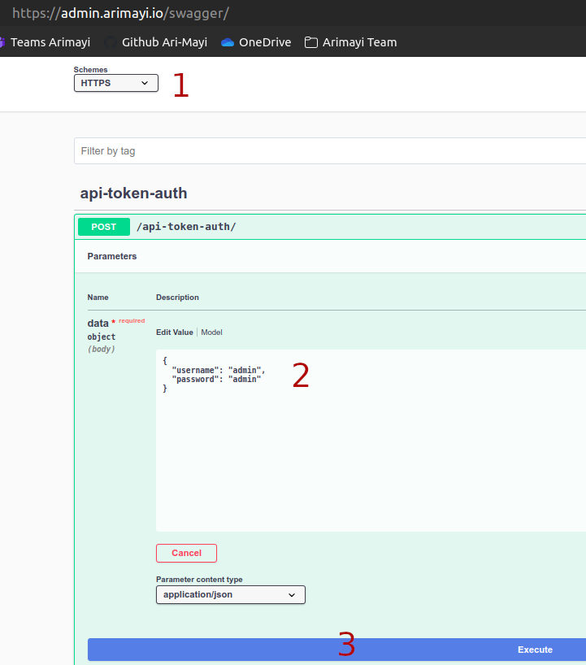
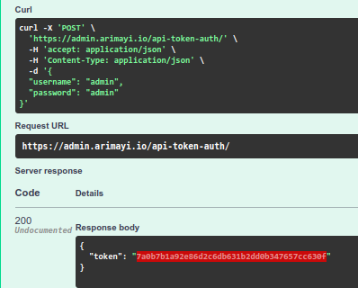
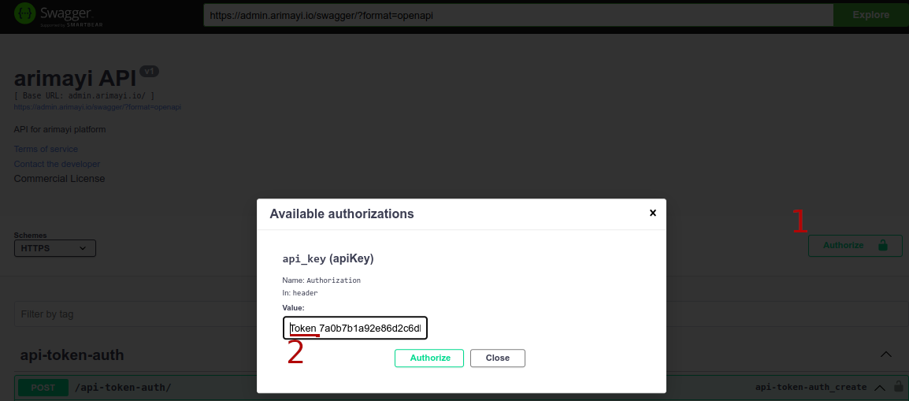

# HOW TO USE SWAGGER AUTH 

# Generate a Token
- Access url [https://admin.arimayi.io/swagger/](https://admin.arimayi.io/swagger/)
- Set `Schemes` to `HTTPS`
- Set usenanme / password to `admin` / `admin`
- Click Execute 

- Copy the generated token 

- Click `Authorize` and enter the text "**Token**  *abcdebfgiklmonpq*"

- Click `Authorize` and `Close`

Now you can test other endpoints 💪 